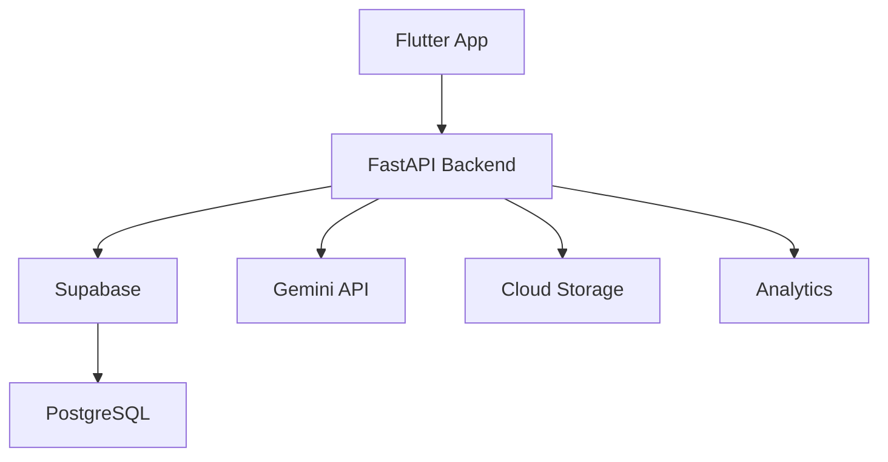

<div align="center">

# Om Nitin Harde

### AI Engineer • Full-Stack Developer • Founder @ B2CSolution

Building scalable AI systems, cloud infrastructure, and modern software products.

[](https://git.io/typing-svg)

<p align="center">

<a href="https://github.com/omharde42">

</a>

<a href="https://github.com/omharde42?tab=followers">

</a>

<a href="https://github.com/omharde42">

</a>

</p>

</div>

---

# 🚀 About Me

- 🏢 Founder & CEO of **B2CSolution**
- 🤖 Creator of **JARVIS AI**
- 🎮 Building **GAMERHUB**
- 🗄️ Developing **VCoreDB**
- 🎓 Class 12 HSC Student
- 🥋 2nd Dan Black Belt in Karate
- 💻 Passionate about AI, Backend Systems, Flutter, and Cloud Computing

---

# 🔥 Current Focus

```yaml
Company: B2CSolution

Currently Building:
  - JARVIS AI
  - GAMERHUB
  - VCoreDB

Learning:
  - System Design
  - Kubernetes
  - DevOps
  - Cloud Infrastructure
  - Artificial Intelligence

Goals for 2026:
  - Launch JARVIS AI
  - Release GAMERHUB
  - Scale VCoreDB
  - Build Global Software Products
```

---

# 🏢 B2CSolution Ecosystem

## 🤖 JARVIS AI

- AI Chat
- Automation
- Coding Assistant
- Business Assistant
- Research Tools

## 🎮 GAMERHUB

- Tournament System
- Matchmaking
- Communities
- Live Streaming
- Marketplace
- AI Coaching

## 🗄️ VCoreDB

- Backend Infrastructure
- Authentication
- Cloud Storage
- API Services
- Enterprise Scalability

---

# 🏗️ System Architecture



---

# 🛠 Tech Stack

## Languages


---

## Frontend


---

## Backend


---

## Database


---

## DevOps


---

# 📊 GitHub Statistics

<p align="center">


</p>

<p align="center">


</p>

---

# 📈 Contribution Graph

[](https://github.com/ashutosh00710/github-readme-activity-graph)

---

# 🏆 Achievements

- 🥋 2nd Dan Black Belt
- 🤖 AI Developer
- 💻 Open Source Contributor
- 🚀 Founder of B2CSolution
- 🎓 Student Developer

---

# 🎯 Fun Facts

- 🎮 Gamer
- 🤖 AI Enthusiast
- 🚀 Entrepreneur
- ☁️ Cloud Computing Enthusiast
- 📱 Loves Building Apps

---

# 📫 Connect With Me

### GitHub

https://github.com/omharde42

### LinkedIn

https://www.linkedin.com/in/om-harde-74644140b

### Instagram

Personal:

@itzomharde_6

Business:

@techdesigner_30

### Email

b2csolution2436@gmail.com

---

# 💬 Quote

> "Great products are not built overnight—they are built through thousands of small improvements, relentless curiosity, and the courage to keep shipping."

— **Om Nitin Harde**

---

<div align="center">

## 🚀 B2CSolution

Innovate • Build • Scale

Building JARVIS AI • GAMERHUB • VCoreDB

⭐ Thanks for visiting my profile!

</div>
